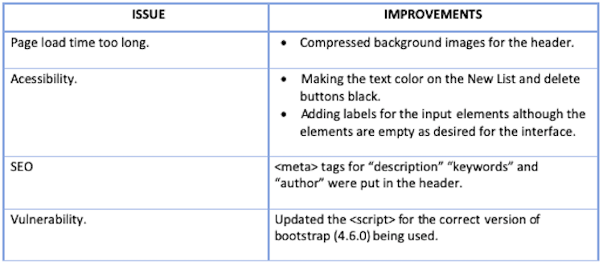
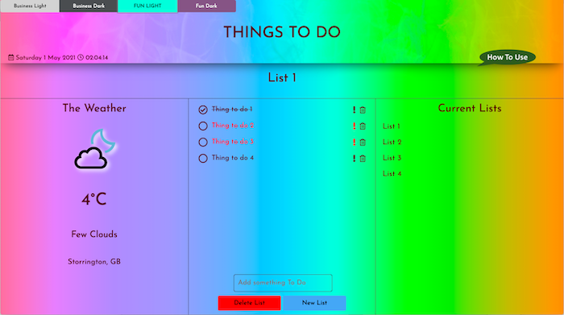
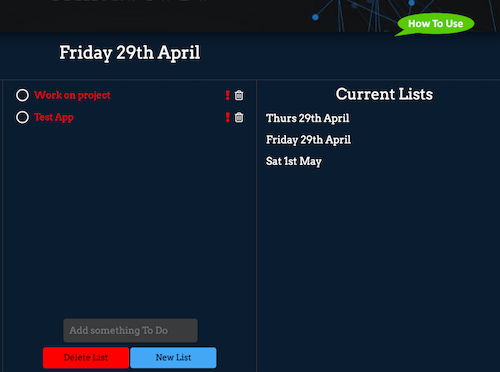
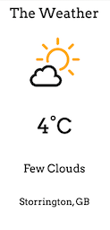
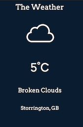
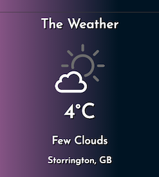

# JavaScript To Do List

A web-based To-Do-List app for Code-Institute's Fullstack Developer Diploma Milestone Two project.

## **Preview** 

The deployed site on GitHub Pages can be viewed [here.](https://juliet-simpson.github.io/js-to-do-list/)

Previews of the interface themes on different devices can be viewed here:

## User Stories

* A user who struggles with keeping multiple manually written to-do lists is looking for an automated alternative on their devices.

* A user who is struggling with organisation wants to keep a record of tasks they need to do that can be easily updated with new items, urgent ones highlighted and finished ones checked or deleted.

* A user who is struggling with motivation wants an attractive interface to encourage them to engage with the tasks they must perform.

* A user wants to be able to return to the app after closing it and review lists that they have written at an earlier date.

* A user would like to obtain information about the weather in their location at the same time as reviewing their things-to-do.

* Two users wish to use the app from the same device and would like to each be able to access their own list.

## UX

### **1. Strategy**

To create a to do list app that meets the needs of the user stories.

### **2. Scope**

Features to include:

* Option to change overall colour scheme, preference saved locally to reload on the next visit.

* Date and time
* Input to name a list, make the input value the list title to display that instead of the input, and add that title to a 'list of lists'.
* Create multiple lists.
* List of lists where a list name can be clicked on to open that shows to do items in the main panel.
* Text input to add to do items to the currently open list.
* Option to strike-through completed to do items.
* Option to highlight urgent items in red.
* Option to delete items.
* Lists locally saved so that they can be retrieved after a user's first visit.
* Connect to a weather API to give current weather information.
* Button to delete the currently open list.
* Button to start a new list, saving the one open.
* A clickable 'How to use" speech bubble button which opens a modal overlaying the page giving instructions for using the app.

### **3. Structure**

* The app will be all on one page.  

* It will be responsive for different screen sizes and the layout will vary accordingly.  
* The header will contain the colour scheme selection options, page title, the date and time and the How To Use speech bubble button to open the modal. 
* Below the header, a section containing a text input field to name the list OR the title of the currently open list.  
* The weather API will be to the left of the screen on a desktop and in the bottom section of the page on a tablet and a mobile.
* The to do list items will be displayed centrally on the screen with a 'done' checkbox to the left and urgent and trash button icons to the right of each item. 
* The 'enter a to-do' text input will be central at the bottom of the page on a desktop or at the bottom of the 'to dos' section on a tablet or mobile.
* List titles will display in a column to the right of the screen on desktop and between the todos and the weather on a mobile or tablet.

### **4. Skeleton**

The wireframes can be viewed here:

- [Wireframes](assets/wireframes/wireframes.pdf)

### **5. Surface**

There will be 4 different themes to choose from each with its own colour scheme. There will be a font for the business themes and a font for the fun themes.  The 4 themes will be:

* Business light:
    * A pleasant but non distracting theme with a mainly white background.

* Business dark:
    * A pleasant but non distracting theme with a dark coloured background and white text in contrast.

* Fun light:
    * A vibrant and exciting rainbow theme to encourage the user to find getting things done 'fun'.

* Fun dark:
    * An artistic and attractive dark coloured theme aiming to lift the mood of the user without being overly bright.

## Features

### Included:

* A button bar to select an interface color scheme at the top of the page. The selection will be saved to local storage and be the theme that shows on reloading the page.

* The date and time shown in the header.

* A speech bubble button in the header or dropping just below and overlaying the page to open a modal which gives instructions for using the app.

* An X button at the top right of the modal to close it.

* A text input field to name a list, the entered text being converted to a list title in the place of the text input on pressing enter. The entered text will also be appended to the 'list of lists' under the heading Current Lists.
* An alert box will appear warning the user of a duplicate list name if the same list name is entered twice.  The duplicate list name will not be added.

* The list name will be saved to local storage and will still be visible under the heading Current Lists on returning to the page.  

* Each list name under Current Lists will be clickable to put that list name into the position of list title and show the to do items in that list in the To Do list section.  If it gets longer than the available space it will become scrollable.

* There will be a space for items to do, central to the page. On mobile this will initially be a small height but increase with added items until a maximum is reached after which the list of to do items will be scrollable.

* At the bottom of the to do items section the will be a text input field to add an item to do on entering some text and then pressing enter.

* If an attempt is made to add a to do item without a list being named, an alert will appear asking the user to first select of name a list.

* If a duplicate to do item is entered in one list an alert will appear tell the user that to do is already listed.  It won't then be added to the list.

* To the left of each item to do will be a circle that can be checked.  A checked item will then appear with a line through the text.

* To the right of an item will be an exclamation icon which can be clicked to turn itself and the text of the to do item red.  Clicking it again will remove the red color. If an item has been checked the red color is disabled.

* To the right of the urgent icon will be a trash icon which will remove the to do item from the list.

* Below the Add Something To Do input will be a New List and a Delete List button.

* The delete list will remove a list name and its to dos from the Current lists and from local storage.

* The new List button will retain the previous list name under current lists and its associated to dos will be stored in local storage.  The New List Name input box will return and replace the previous list tile.  The to dos section will be cleared.

* The current weather in the user's location will be shown in a panel to the left of the screen on desktops and on scrolling to the bottom of the app on mobiles.  A request will be made on a user's first visit for them to allow geolocation for this.

* A notification will be shown in the weather section if there is a problem with obtaining geolocation or weather data.

* All the lists, with their associated to do do's with their associated custom attributes, will be saved in local storage and be able to be reviewed on reopening the app after closing.

* The app will reopen showing the last list that was open (if there was one).

### Left to implement

* Trash icons next to each list name in the list of current lists so that a list can be deleted without the necessity of first opening it.

* An encouraging sound when a to do item is checked as done.
* A sound when a to do item is trashed.
* A 'Well Done' gif or a visual effect when a to do item is checked as done.

## Technologies

### Languages

- [HTML5](https://en.wikipedia.org/wiki/HTML5)

- [CSS3](https://en.wikipedia.org/wiki/Cascading_Style_Sheets)
- [JavaScript](https://en.wikipedia.org/wiki/JavaScript)

### Frameworks, Libraries and Tools 

- [Balsamiq:](https://balsamiq.com/)
    * Creation of the wireframe mock ups.

- [Am I Responsive:](http://ami.responsivedesign.is/)
    * Checking of responsiveness and creation of the previews in this README.

- [Bootstrap (version 4.6.0](https://getbootstrap.com/docs/4.6/getting-started/introduction/)) 
    * **CSS and HTML** For responsive layout for different screen sizes.
    * **CSS, HTML and JavaScript** for How To Use modal.

- [Google Fonts](https://fonts.google.com/)
    * Used to import the 'Arvo' font for the business themes and the 'Josefin Sans' font for the fun themes into the style.css file.

- [Git](https://git-scm.com/)
    * Git was used for version control by utilizing the Gitpod terminal to commit to Git and Push to GitHub.

- [GitHub:](https://github.com/)
    * GitHub is used to store the projects code after being pushed from Git.

- [GitPod](https://www.gitpod.io/)
    * IDE used for development and testing.

- [Google Chrome Dev Tools](https://developer.chrome.com/docs/devtools/)
    * Used throughout the development process to view the console and locate errors in javascript and assist with layout and styling.

- [Font Awesome:](https://fontawesome.com/)
    * Icons for Date and Time and for 'to do' items, made clickable to indicate done, urgent or trash.

- [OpenWeatherMap](https://openweathermap.org/current)
    * Used for the API call to get current weather data based on latitude and longitude.

- [Paint-X:](https://paint-x.com/)
    * Used to create the 'How To Use', 'Delete List' and 'New List' Buttons.

- [COMPRESS PNG:](https://compresspng.com/)
    * Used to compress background images to improve loading time.

## **Testing**

### **Third Party Tools/Services**

- [W3C HTML Validator](https://validator.w3.org/nu/#textarea): Used to Validate the HTML code by copying and pasting code from index.html into this webpage. 
* The HTML code passed through this with no errors or warnings.

- [W3C CSS Validator](https://jigsaw.w3.org/css-validator/validator): Used to validate the code from all css files individually by pasting the code into this page.
    * The CSS code all passed with no errors or warnings.

- [JSHint](https://jshint.com/): Used to validate code from all javascript files individually by pasting them into this webpage.
    * All code passed with no errors.
    * list.js and weather.js caused warnings that the code was only compatible with ES6 as template literal syntax and 'let' to declare variables had been used.  I believe these are acceptable for this project.

- [Chrome Lighthouse Extension](https://developers.google.com/web/tools/lighthouse/): Used to audit the app.   
    * Some improvements and changes were needed to improve lighthouse scores.  These are summarised in this table:
    

    * A summary of the subsequent lighthouse results are shown here:
     

### Manual Testing
**Bugs and fixes**
A summary of the bugs and fixes is shown below:

**Functionality**
1. All the features were tested on the following and were confirmed to be functioning correctly, following the bug fixes detailed above: 

* Browsers:
    * Google Chrome
    * Safari
    * Mozilla 
    * MicroSoft EDGE

* Devices:
    * 13" MacBook Air 
    * iPhone 7
    * Samsung S8

* Other devices were tested through Google Chrome DevTools:
    * Moto G4
    * Galaxy S5
    * Pixel 2
    * Pixel 2 XL
    * iPhone 5/SE 
    * iPhone 6/7/8 
    * iPhone 6/7/8 Plus
    * iPhone X 
    * iPad
    * iPad Pro 
    * Surface Duo 
    * Galaxy Fold 

* Responsiveness was tested on the following screen widths using DevTools (Sizes in px):
    * 320 
    * 375 
    * 425 
    * 768
    * 1024
    * 1440

**Pending Issues**

* None known

### User Stories

Each user story was tested individually and consideration given to how it may be satisfied by this app.

* A user who struggles with keeping multiple manually written to-do lists is looking for an automated alternative on their devices.
    * The app supports multiple named lists of things to do, to which items can be easily added and removed:
    

* A user who is struggling with organisation wants to keep a record of tasks they need to do that can be easily updated with new items, urgent ones highlighted and finished ones checked or deleted.
    * A New item to do can be easily added by entering text into the 'Add Something To Do' text input field.
    * Urgent items can be highlighted in red by clicking the adjacent exclamation icon.
    * Completed items can be ticked off and stuck through by clicking the circle to the left of the item.
    

* A user who is struggling with motivation wants an attractive interface to encourage them to engage with the tasks they must perform.
    * Either of the 'fun' themes, Fun Light or Fun Dark may please this user and encourage them to open the app as a first step in becoming more productive.
    
    

* A user wants to be able to return to the app after closing it and review lists that they have written at an earlier date.
    * On closing the app, closing the browser, shutting down the device and then reopening it, the previously entered lists and their associated to dos will still be present as when it was closed.
    * Further organisation could be achieved by giving a list the date on which it was written as a title.  Similarly a day on which things must be done could be used as a title:
    

* A user would like to obtain information about the weather in their location at the same time as reviewing their things-to-do.
    * Provided that their browser has geolocation enabled in their browser and they allow the app to know their location on the first visit, the user can see weather information for their location on the left of the screen on larger screens and by scrolling to the bottom of the app on smaller screens.
    * Colour effects have been added to the icons if needed to make sure they all visible on all backgrounds:
    
    
    
    

* Two users wish to use the app from the same device and would like to each be able to access their own list.
    * Each person requiring a list can name it for themselves and keep their own things to do in that list, while another person using the same device can also do this.  For example:

    
    

## Deployment

### Deployment to GitHub Pages:

1. Log into GitHub and locate the repository [Juliet-Simpson/js-to-do-list](https://github.com/Juliet-Simpson/js-to-do-list)

2. At the top of the list of files, below the repository name there is a horizontal menu.  Select "settings" from this menu.
    

3.  Scroll down the settings page until the "GitHub Pages" section is located.  

4. Click the link to open the GitHub Pages tab.
    

5. From the "Select branch" dropdown, select "master"

6. From the "Select folder" dropdown, select "root"

7. Press the "Save" button
    

8. The adress of the deployed site can now be viewed in the green box as a link.

9. Test this link.

### To make a clone in your chosen editor:

1. Log into GitHub and locate the repository [Juliet-Simpson/js-to-do-list](https://github.com/Juliet-Simpson/js-to-do-list)

2. Select the clone dropdown and then click the clipboard icon to copy the link.
    

3. Type git clone and then paste this link into the terminal of your chosen editor and press enter:
`git clone https://github.com/Juliet-Simpson/js-to-do-list.git`

4. To cut ties with this GitHub repository, type `git remote rm origin` into the terminal.

## Credits

### Concept

* The idea for the app was coceived by me

### Code

* Button bar and modal:

    * [Bootstrap (version 4.6.0](https://getbootstrap.com/docs/4.6/getting-started/introduction/)) 

* Rainbow background for fun light theme:

    * This [Stack Overflow Post](https://stackoverflow.com/questions/56418763/creating-the-perfect-rainbow-gradient-in-css#answer-63302468) with the colors changed.

* All other code was written by me.

### Sources

#### JavaScript

* Changing themes

    * https://www.youtube.com/watch?v=_XAQH41rjio

    * https://stackoverflow.com/questions/52920019/save-current-stylesheet-to-local-storage

* Date and time

    * https://www.youtube.com/watch?v=HyhVjHGb19k

* Weather API 

    * https://www.youtube.com/watch?v=KqZGuzrY9D4&list=RDCMUC8n8ftV94ZU_DJLOLtrpORA&index=3

* To do lists

    * https://www.youtube.com/watch?v=b8sUhU_eq3g&t=2315s

    * https://blog.logrocket.com/localstorage-javascript-complete-guide/#setitem

    * https://blog.logrocket.com/localstorage-javascript-complete-guide/#getitem

    * https://developer.mozilla.org/en-US/docs/Web/JavaScript/Reference/Global_Objects/Array/forEach

    * https://stackoverflow.com/questions/16626735/how-to-loop-through-an-array-containing-objects-and-access-their-properties

    * https://flaviocopes.com/insertadjacenthtml/

    * https://medium.com/@deniscangemi/remove-element-from-array-in-javascript-bf2d2428733

    * https://developer.mozilla.org/en-US/docs/Web/JavaScript/Reference/Template_literals

    * https://stackoverflow.com/questions/11715646/scroll-automatically-to-the-bottom-of-the-page

    * https://developer.mozilla.org/en-US/docs/Web/API/Element/scrollTo

    * https://www.w3schools.com/jsref/met_element_getelementsbytagname.asp

#### CSS

* Layout

    * https://stackoverflow.com/questions/7425665/switching-the-order-of-block-elements-with-css

    * https://css-tricks.com/a-complete-guide-to-calc-in-css/

    * https://css-tricks.com/snippets/css/a-guide-to-flexbox/#flexbox-properties

    * https://www.w3schools.com/howto/howto_css_hide_scrollbars.asp

* Weather Images

    * https://codepen.io/sosuke/pen/Pjoqqp 

### Images

* Background Images

    * https://wallpapersafari.com/

    * https://www.teahub.io/

    * https://cutewallpaper.org/

* Weather Icons

    * https://github.com/manifestinteractive/weather-underground-icons

### Acknowledgements

* My Code Institute Mentor

* Code Institute Tutor Support

* My friend Yassine Ait Mensour for advice on saving the JavaScript lists object

